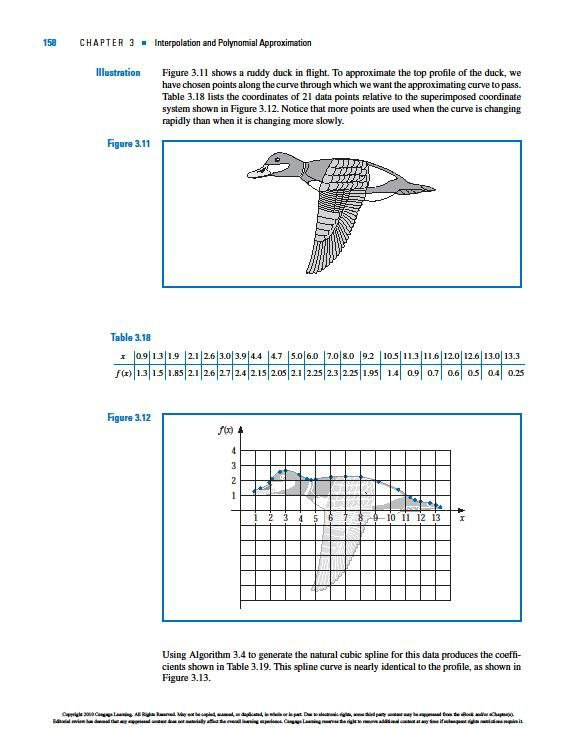
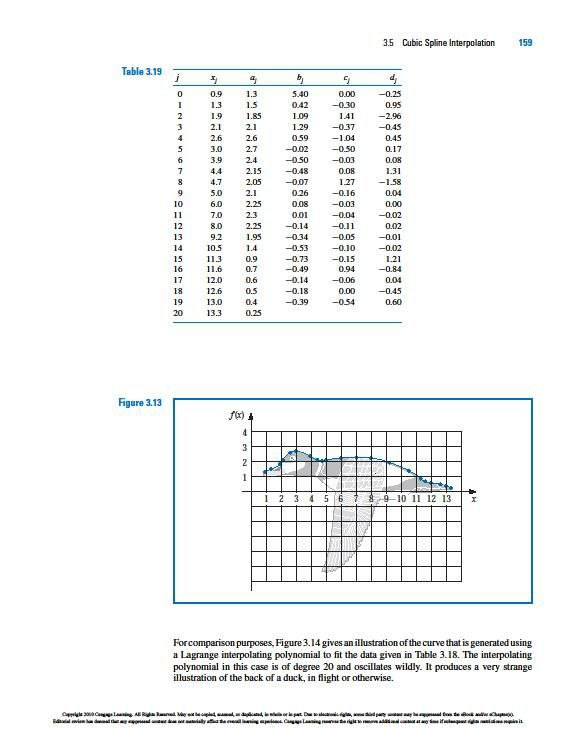
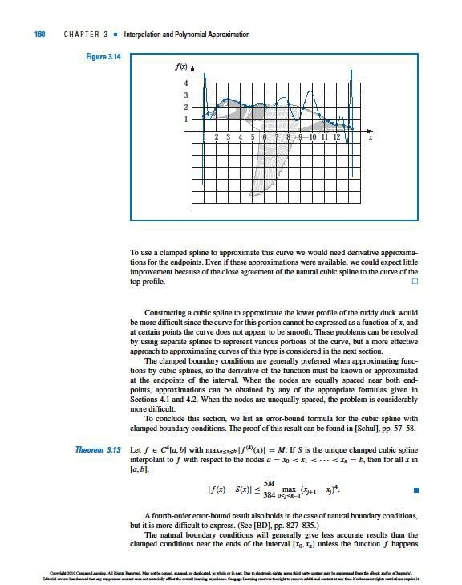
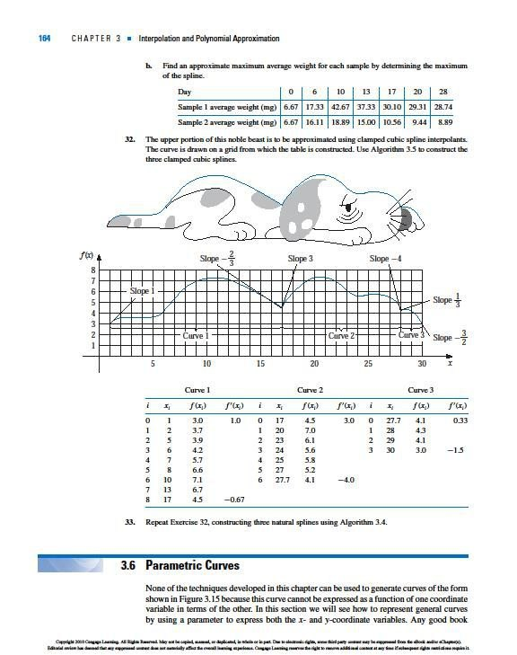

# 🖋️ Animal Shape Spline Problems

This repository contains the code solutions for two creative spline problems that draw animal shapes.  

## 🔹 Problem 1: Bird in Flight 🐦

- Use splines to construct a smooth curve representing a **bird soaring in the sky**.  
- Focus on smooth, continuous curves to capture the elegant motion of wings and body.  

## 🔹 Problem 2: Sleeping Dog 🐶

- Use splines to construct a smooth curve representing a **dog lying down and sleeping**.  
- Focus on curves that capture the relaxed posture and natural contours of the dog.  

## 🔹 About Splines

A **spline** is a piecewise polynomial function used to create smooth curves.  
They are commonly used in:  
- **Computer graphics and animation** 🎨  
- **Path planning and simulations** 🤖  
- **Data interpolation and shape modeling** ✏️  

This project demonstrates how **mathematical splines can be used to draw smooth and realistic animal shapes**.

  

  

  

  

